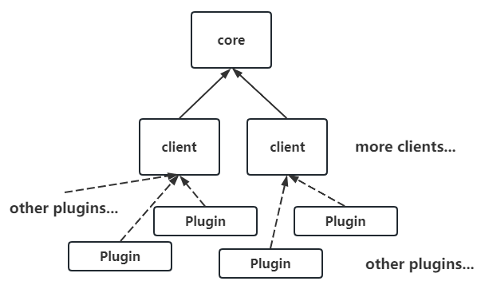
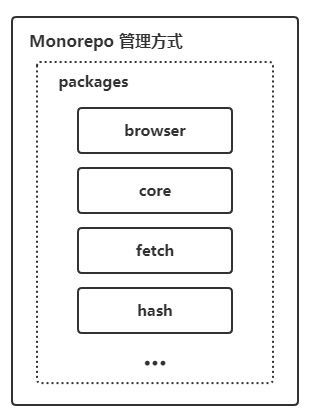
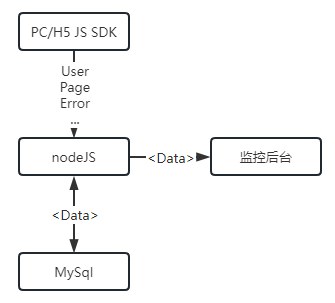
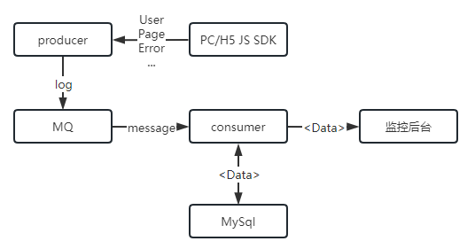

# 架构

## 架构

为了实现功能的按需引入与可扩展性，整体采用插件化架构

如上图，不同端继承自 Core，每个端各自有多种功能的插件，根据需要引入即可

为了能统一工作流，降低项目基建成本，提高团队协作性；项目采用目前主流的 `monorepo` 方式进行代码管理，即把多个 packages 放在同一仓库中，插件也将作为独立的子包放在 packages 下，统一编译、调试、发布

## 数据流

这里我实现了两种模式的服务

### 单服务

该模式下日志的上报、写入，与监控后台日志的读取在同一 node 服务中，如下图

node 服务既负责接收日志，也负责读写数据库

### 多服务

该模式拆分了“消费服务”与“生产服务”，同时使用了 RabbitMQ 达到削峰填谷的效果，如下图所示

producer 即生产者，负责接收客户端上报的日志，并推入消息队列。

consumer 也即消费者，从消息队列中读取消息，拼接日志信息，写入数据库中；同时处理监控后台发来的请求，从数据库中读取相应信息，处理后返回给监控后台。
