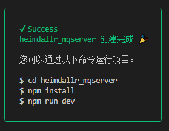

# 工具

## @heimdallr-sdk/cli

heimdallr-sdk 的脚手架工具

主要作用就是为了能够快速部署“监控服务端”与“监控管理后台”

全局安装脚手架

```bash
npm i @heimdallr-sdk/cli
```

安装完成后输入 `heimdallr-create` 命令，即可开始选择相应的模板


提供“监控后台管理台”和“监控服务”以及“带消息队列的监控服务” 三类模板

依次完成配置（作答），在当前目录下将自动创建项目文件夹



三个模板前文已经介绍了，这里就不再赘述了

## @heimdallr-sdk/webpack-plugin-sourcemap-upload

这个插件，件如其名（狗头），主要功能就是在以 webpack 为构建工具的项目中完成 sourcemap 文件的上传

在 webpack 构建完成后，将产出的 sourcemap 文件自动上传到指定服务器

用法也简单，指定一下初始化 sdk 时的应用名称，以及文件上传的接口地址即可

```js
import UploadSourceMapPlugin from "@heimdallr-sdk/webpack-plugin-sourcemap-upload";
const config = {
  plugins: [
    new UploadSourceMapPlugin({
      app_name: "playground",
      url: `http://localhost:8001/sourcemap/upload`,
    }),
  ],
};
```

## @heimdallr-sdk/vite-plugin-sourcemap-upload

这个插件功能同上，不同点在于，上一个插件是针对以 webpack 为构建工具的项目，而这个插件是针对以 vite 为构建工具的项目

同样是在 vite 构建完成后，将产出的 sourcemap 文件自动上传到指定服务器

因为 vite 底层其实是使用 rollup 构建，因此，该插件监听的是 writeBundle 和 closeBundle 两个阶段的 hook

用法如下

```js
import sourceMapUpload from "@heimdallr-sdk/vite-plugin-sourcemap-upload";

export default defineConfig({
  plugins: [
    vue(),
    sourceMapUpload({
      app_name: "playground",
      url: `http://localhost:8001/sourcemap/upload`,
    }),
  ],
  build: {
    sourcemap: true,
  },
});
```

使用时需要注意的是，@heimdallr-sdk/webpack-plugin-sourcemap-upload 对外暴露的是一个类，而 @heimdallr-sdk/vite-plugin-sourcemap-upload 对外暴露的则是一个函数
